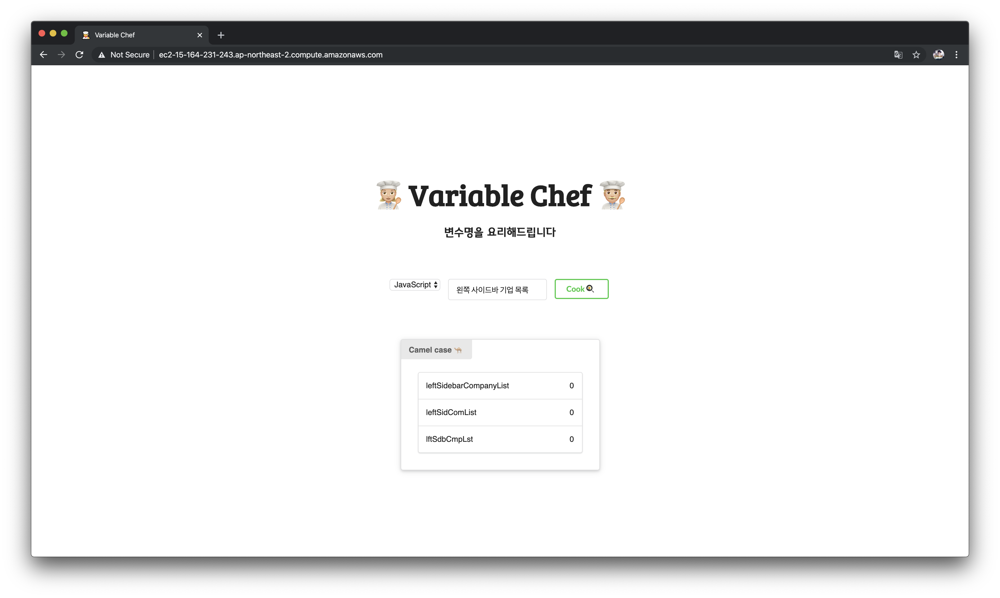

# Variable Chef

👨‍🍳 Let me cook your variable 👩‍🍳

한글 단어를 snack case, camel case 와 같은 변수명명법에 알맞는 단어로 추천해주는 서비스



## Deployment

Use our service. [Variable Chef](http://ec2-15-164-231-243.ap-northeast-2.compute.amazonaws.com)

&nbsp;

## Getting started

1. Installation

   - Git Clone

       ```bash
        git clone https://github.com/jiwookseo/variable_chef.git
       ```

   - or [Download ZIP](https://github.com/jiwookseo/variable_chef/archive/master.zip)

   &nbsp;
   
2. Settings

   *  환경 변수 설정
   
        환경 변수를 `~/.bashrc` ,  `~/.zshrc` 같은 Shell environment 에 추가해줍니다.
        
        ```
        export GOOGLE_APPLICATION_CREDENTIALS="<your_credential_file_path>"
        export NAVER_ID="<your_id>"
        export NAVER_SECRET="<your_secret>"
        ```

   &nbsp;

   * Backend 설정

      backend directory 로 이동합니다.
      
      ```bash
      cd backend
      ```
      
      &nbsp;
      
      `pip install` 명령어를 통해 `requirements.txt` 에 저장된 의존성 패키지를 설치합니다.
      
      ```bash
      pip install -r requirements.txt
      ```
      
      &nbsp;
      
      migrate를 한 뒤 Django 프로젝트를 실행합니다.
      
      ```bash
      python manage.py makemigrations
      python manage.py migrate
      python manage.py runserver
      ```
   
   &nbsp;
   
   *  Frontend 설정
   
      frontend directory 로 이동합니다.
      
      ```bash
      cd frontend
      ```
      
      &nbsp;
      
      `yarn` 명령어를 통해 의존성 패키지를 설치하고 Recat 서버를 실행합니다.
      
      ```bash
      yarn
      yarn start
      ```

&nbsp;

## Built With

### Backend

* Django 2.2
* Django REST framework 3.9.2
* Google Cloud Natural Language API

&nbsp;

### Frontend
* React: 16.8.6
* semantic-ui-css: 2.4.1
* semantic-ui-react: 0.86.0
* styled-components: 4.2.0
* axios: 0.18.0

&nbsp;

## Authors

* Frontend
  * [Eunjeong Park](https://github.com/ejolie)

* Backend and Deploy
  * [Jiwook Seo](https://github.com/jiwookseo)

